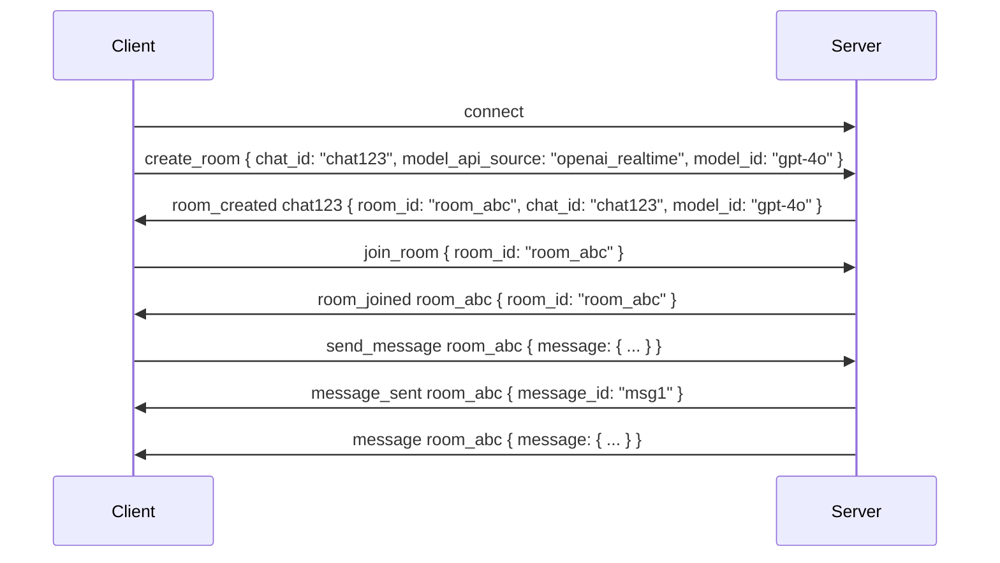
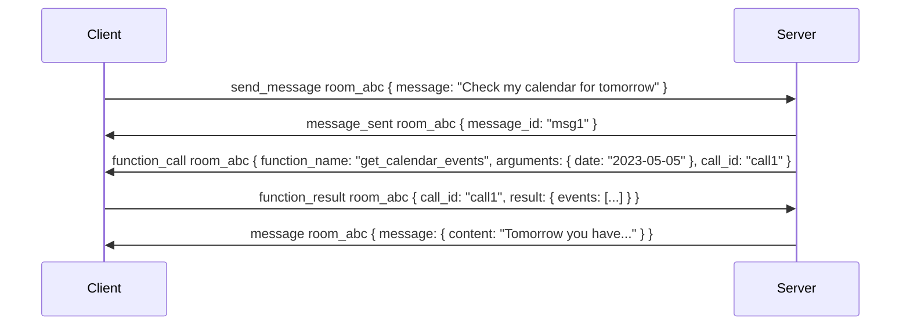

# Socket.IO Events Documentation

This document details all Socket.IO events used in the AssistantWebserver's real-time communication system.

## Namespace: `/assistant/realtime`

The AssistantWebserver uses the `/assistant/realtime` namespace for all assistant-related Socket.IO events.

### Connection Events

| Event | Direction | Data | Description |
|-------|-----------|------|-------------|
| `connect` | Client → Server | Auth token in query params | Establishes initial connection with authentication |
| `disconnect` | Client → Server | - | Client disconnects from the server |

### Room Management Events

| Event | Direction | Data | Description |
|-------|-----------|------|-------------|
| `create_room` | Client → Server | `{ chat_id, model_api_source, model_id }` | Request to create a new chat room |
| `room_created {chat_id}` | Server → Client | `{ room_id, chat_id, model_id }` | Confirmation that room was created |
| `room_error {chat_id}` | Server → Client | `{ error }` | Error occurred during room creation |
| `join_room` | Client → Server | `{ room_id }` | Request to join an existing room |
| `room_joined {room_id}` | Server → Client | `{ room_id }` | Confirmation that client joined room |
| `room_join_error {room_id}` | Server → Client | `{ error }` | Error occurred during room join |
| `leave_room` | Client → Server | `{ room_id }` | Request to leave a room |
| `room_left` | Server → Client | `{ room_id }` | Confirmation that client left room |
| `find_chat` | Client → Server | `{ chat_id }` | Request to find room for a chat |
| `room_found {chat_id}` | Server → Client | `{ room_id, chat_id }` | Room was found for given chat |
| `room_not_found {chat_id}` | Server → Client | `{ room_id, chat_id }` | No room found for given chat |

### Messaging Events

| Event | Direction | Data | Description |
|-------|-----------|------|-------------|
| `send_message {room_id}` | Client → Server | `{ room_id, message }` | Send a message to a room |
| `message {room_id}` | Server → Client | `{ message }` | New message in a room |
| `message_sent {room_id}` | Server → Client | `{ message_id }` | Confirmation message was sent |
| `error {room_id}` | Server → Client | `{ error }` | Error in room message handling |

### Function Calling Events

| Event | Direction | Data | Description |
|-------|-----------|------|-------------|
| `function_call {room_id}` | Server → Client | `{ function_name, arguments, call_id }` | AI wants to call a function |
| `function_result {room_id}` | Client → Server | `{ call_id, result }` | Client returns function result |
| `function_error {room_id}` | Client → Server | `{ call_id, error }` | Error during function execution |

### Streaming Events

| Event | Direction | Data | Description |
|-------|-----------|------|-------------|
| `stream_start {room_id}` | Server → Client | `{ message_id }` | Start of a streaming response |
| `stream_chunk {room_id}` | Server → Client | `{ message_id, content, done }` | Chunk of streaming content |
| `stream_end {room_id}` | Server → Client | `{ message_id }` | End of a streaming response |
| `stream_error {room_id}` | Server → Client | `{ message_id, error }` | Error during streaming |

## Example Flows

### Room Creation and Message Flow

### Function Calling Flow

## Implementation Notes

- All room-specific events include the room ID in the event name (e.g., `message {room_id}`)
- Message objects follow a standard format with required fields: `message_id`, `content`, `role`, `timestamp`
- Function call arguments are passed as a JSON object
- Streaming events allow for real-time display of AI responses with minimal latency
- The Socket.IO server manages rooms with the `enter_room` and `leave_room` Socket.IO functions 